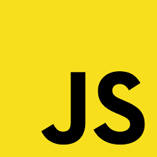
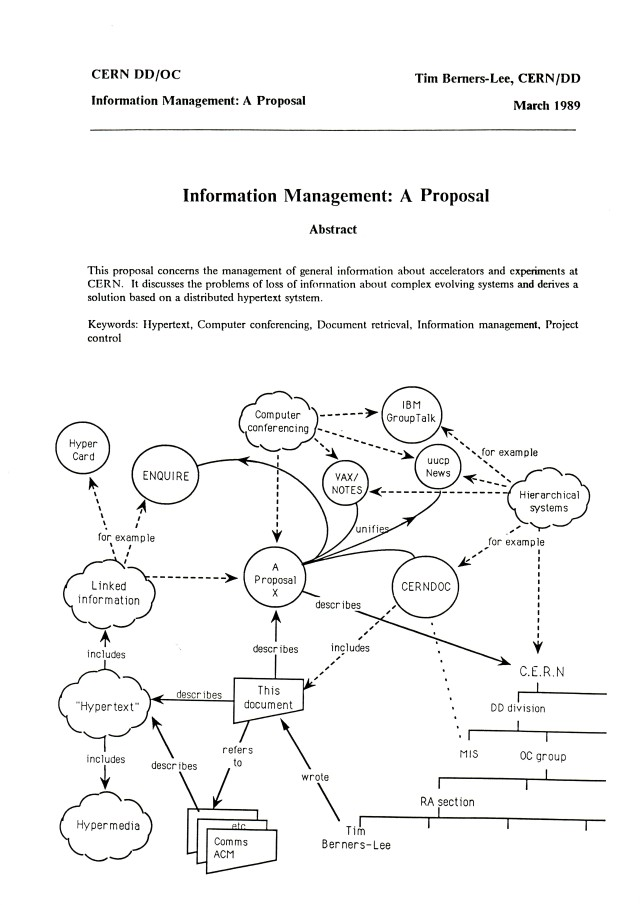
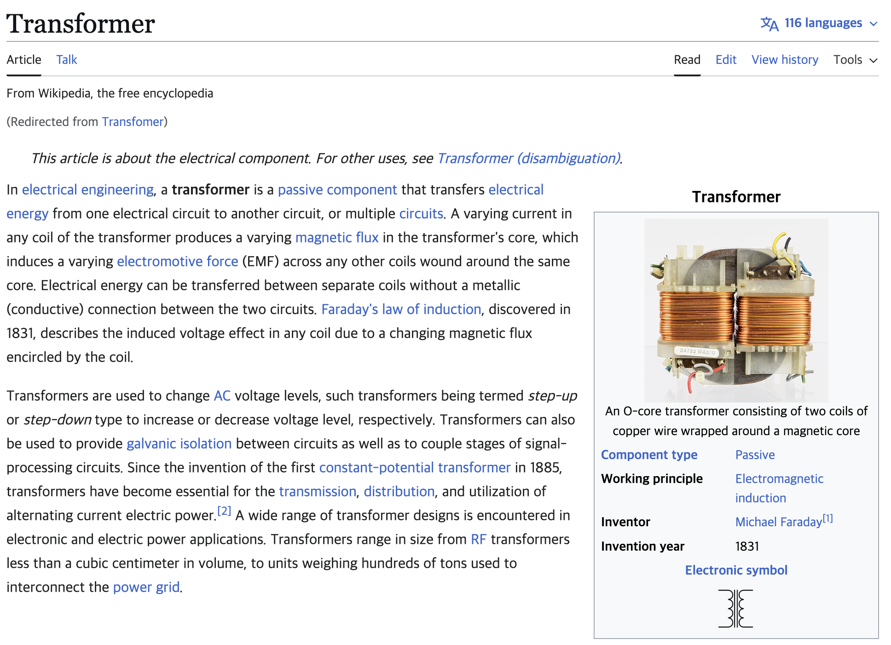
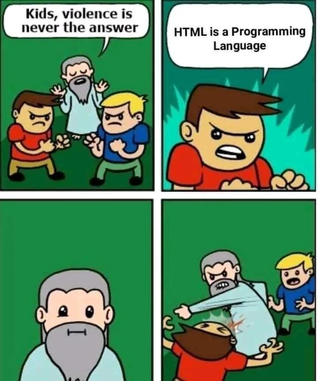
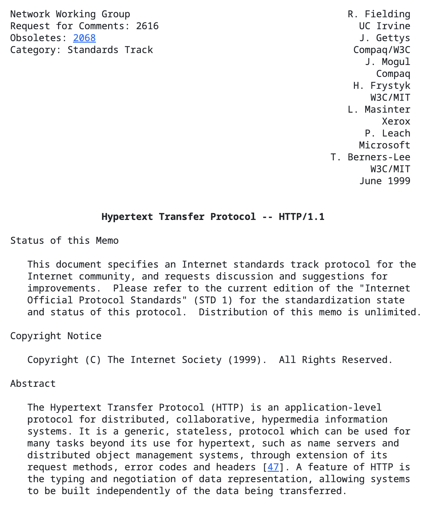
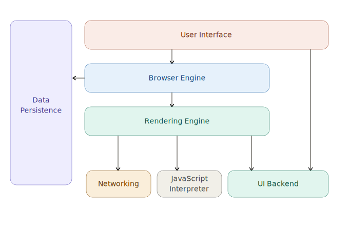
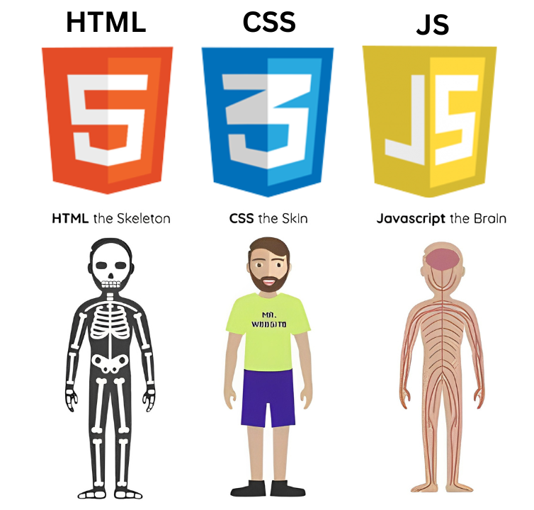
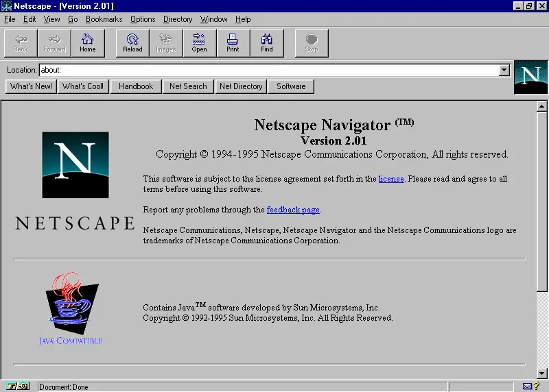
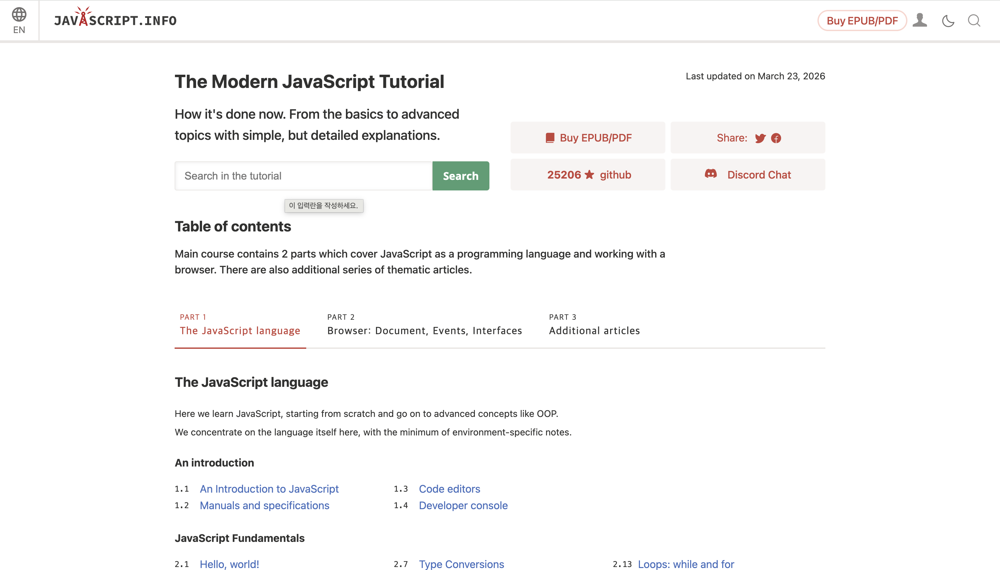

<!-- Make Blank for Image-->
<!-- turn off the dark effect on background-->

<style>
.slidev-layout {
  background-image: url('assets/js-thumbnail.png') !important;
}
</style>

---
hideInToc: true
---

# 목차

<Toc columns=2 />

---

# 안녕하세요!


<div className="flex items-center justify-evenly gap-8 h-3/4">

<div>
<h2 class="my-4">이승헌</h2>
<div>
    <ul>
        <li>고려대학교 자유전공학부 컴퓨터학과 (2021.03~)</li>
        <li>NEXT 13기 (2025)</li>
        <li>DailyCompound (2025.07~2026.03)</li>
    </ul>
</div>
</div>
</div>

---

# What is JavaScript (JS)?

<div class="flex flex-col items-center justify-center h-full gap-6">
  
  <p class="text-3xl text-center"><span class="underline">브라우저</span>에서 돌아가는 <span class="underline">프로그래밍 언어</span></p>
</div>

---

# 브라우저 (Browser)

브라우저에 `google.com` 입력을 입력하면 무슨 일이 발생할까요?

<React is="RequestResponse" />


---
hideInToc: true
---

## 인터넷

<div class="flex gap-4">
  <figure class="w-1/2">
    
    <figcaption>해저 케이블</figcaption>
  </figure>
  <figure class="w-1/2">
    
    <figcaption>KT 혜화지사</figcaption>
  </figure>
</div>

---

## Web

- **1989년**, CERN의 **Tim Berners-Lee**
- 과학자 간 정보 공유를 위해 World Wide Web 창안


<div style="display:flex; justify-content:center; gap:48px; margin: 24px 0;">
  <figure style="display:flex; flex-direction:column; align-items:center; margin:0;">
    
    <figcaption style="margin-top:8px; text-align:center;"><strong>Tim Berners-Lee</strong><br/><span style="color:#888; font-size:0.85em;">WWW 창시자</span></figcaption>
  </figure>
  <figure style="display:flex; flex-direction:column; align-items:center; margin:0;">
    
    <figcaption style="margin-top:8px; text-align:center;"><strong>Information Management: A Proposal</strong><br/><span style="color:#888; font-size:0.85em;">1989, CERN</span></figcaption>
  </figure>
  <figure style="display:flex; flex-direction:column; align-items:center; margin:0;">
    
    <figcaption style="margin-top:8px; text-align:center;"><strong>World Wide Web</strong><br/><span style="color:#888; font-size:0.85em;">www.</span></figcaption>
  </figure>
</div>

> **인터넷 vs. 웹**
> - 인터넷 = 도로 인프라
> - 웹 = 그 위를 달리는 자동차

---
hideInToc: true
---

## Web


Web의 3가지 핵심 개념이 이때 탄생:
- **HTML(HyperText Markup Language)** — 문서 작성
- **HTTP(HyperText Transfer Protocol)** — 문서 전송
- **URL(Uniform Resource Locator)** — 문서 주소


---

## HyperText

- 책, 아티클 = 선형적 정보
- 인간의 사고는 **비선형적**
- 모르는 개념 → 바깥 정보 탐색

> HyperText = 다른 정보로 가는 링크(하이퍼링크)를 담은 문서

<div class="flex justify-center gap-8 mt-4">
  <figure class="flex flex-col items-center gap-2">
    
    <figcaption class="text-sm text-gray-400">책: 선형적 정보</figcaption>
  </figure>
  <figure class="flex flex-col items-center gap-2">
    
    <figcaption class="text-sm text-gray-400">위키피디아: 링크를 통해 관련 개념으로 즉시 이동 가능</figcaption>
  </figure>
</div>


---

## HTML

### HyperText Markup Language

- 웹 문서를 작성하는 마크업 언어(≠프로그래밍 언어)
- 구조 표현을 위한 **선언적** 언어

<div class="flex gap-6 items-center justify-evenly">

<div class="w-80">

```html
<!DOCTYPE html>
<html>
  <head>
    <title>Hello</title>
  </head>
  <body>
    <h1>Hello</h1>
    <p>this is html</p>
  </body>
</html>
```
</div>

<figure>
  
  <figcaption>HTML은 프로그래밍 언어가 아닙니다</figcaption>
</figure>
</div>

---

## HTTP

### HyperText Transfer Protocol

- HTML, CSS, JS, 이미지 등을 주고받는 통신 규약


<div class="text-center mt-4"><a href="https://datatracker.ietf.org/doc/html/rfc2616" target="_blank">HTTP Request for Comments</a></div>


---

## URL

### Uniform Resource Locator

- 웹 상의 특정 정보가 있는 위치를 가리키는 주소




---
hideInToc: true
---

## URL

### How Google Search Works?


<React is="BrowserUrls" className="mt-8" />


👉 [세상의 첫 번째 웹사이트: http://info.cern.ch/](https://info.cern.ch/)

---

## 브라우저의 구조

브라우저는 단순한 "웹사이트 탐색기"가 아닙니다

<div class="flex gap-6 items-start">
    

<div class="text-xs">

| 구성요소          | 역할                      |
| ----------------- | ------------------------- |
| User Interface | 주소창, 탭, 버튼 등 외형  |
| Browser Engine | UI ↔ 렌더링 엔진 조율     |
| Rendering Engine | HTML/CSS 파싱 → 화면 출력 |
| Networking | HTTP 요청/응답 처리       |
| **JS Interpreter** | **JS 코드 실행**          |
| UI Backend| 기본 위젯 렌더링          |
| Data Persistence | 쿠키, localStorage 등     |

</div>

</div>

---

## 브라우저 속 JS 엔진

<div style="display:flex; justify-content:center; gap:64px; margin: 32px 0;">
  <figure style="text-align:center; margin:0;">
    
    <figcaption style="margin-top:10px;"><strong>V8</strong><br/><span style="color:#888; font-size:0.85em;">Chrome</span></figcaption>
  </figure>
  <figure style="text-align:center; margin:0;">
    
    <figcaption style="margin-top:10px;"><strong>SpiderMonkey</strong><br/><span style="color:#888; font-size:0.85em;">Firefox</span></figcaption>
  </figure>
  <figure style="text-align:center; margin:0;">
    
    <figcaption style="margin-top:10px;"><strong>JavaScriptCore</strong><br/><span style="color:#888; font-size:0.85em;">Safari</span></figcaption>
  </figure>
</div>


> 브라우저는 자신만의 JS Engine을 가지고 있다
> 
> = 브라우저는 **JS 코드를 실행**할 수 있다

---

# 프로그래밍 언어

- 컴퓨터는 모든 것을 **0과 1**로 처리
- 사람이 0과 1로 명령하는 건 불가능에 가까움

> 프로그래밍 언어 = 인간의 지시와 컴퓨터 언어의 **중간다리**


기계어 (x86 바이너리):

```
48 65 6C 6C 6F 20 57 6F 72 6C 64
B8 01 00 00 00  BF 01 00 00 00
```

JavaScript:

```js{monaco-run} {autorun:false}
console.log("Hello World");
```

---

## 브라우저에서 왜 프로그래밍 언어가 필요할까?

> **유저와의 상호작용 (Interactivity)** 때문

- HTML = 구조
- CSS = 스타일
- JavaScript = **동작**



---
hideInToc: true
---

<React is="HtmlCssJsDemo" />

---

### Case 1: 좋아요 기능

화면을 만드는 건 HTML + CSS로 충분
하지만 좋아요 버튼을 누르면?

1. 유저의 **클릭을 인식**해야 하며
2. 현재 **좋아요 수를 알고** 있어야 하며
3. 좋아요 수 +1, **하트 색상 변경**이 필요

→ HTML, CSS만으로는 불가능

---
hideInToc: true
---

### Case 1: 좋아요 기능

<React is="MusinsaProduct" />

---

### Case 2: 로그인 폼 유효성 검사

로그인 버튼 클릭 시 빈 입력란이 있다면?

1. 아이디/비밀번호 입력란에 **값이 있는지 판단**
2. 비어있다면 **테두리 색 변경 + 안내 문구 표시**

→ 상호작용을 더할 무언가 = **JavaScript**

---
hideInToc: true
---

### Case 2: 로그인 폼 유효성 검사

<React is="MusinsaLogin" />

---

# JavaScript

- **1989년** — World Wide Web 등장
- **1995년** — 당시 가장 인기 있는 브라우저 **Netscape**, "웹에 상호작용성(interactivity)을 더하자!"
- Netscape의 **Brendan Eich**가 **단 10일** 만에 JavaScript 첫 버전 완성

<div class="flex flex-col items-center gap-2 mt-8">
  
  <span class="text-sm text-gray-400">Netscape Navigator 2.01, 1995</span>
</div>


---

# Learn JavaScript



<div className="mt-12 text-center">
    <a href="https://ko.javascript.info/" target="_blank">The Modern JavaScript Tutorial</a>
</div>

---

## [Hello, world!](https://ko.javascript.info/hello-world)

- `<script>` 태그로 HTML 어디서든 JS 삽입 가능
- 브라우저는 `<script>` 태그를 만나면 코드를 **자동으로 실행**

<div class="grid grid-cols-2 gap-4 mt-4">

<div>

**인라인 스크립트**
```html
<body>
  <script>
    alert('Hello, world!');
  </script>
</body>
```

</div>

<div>

**외부 파일로 분리**
```html
<script src="/path/to/script.js">
</script>
```

- `src` 속성과 내부 코드는 **동시 사용 불가**  
-  외부 파일은 브라우저가 **캐시**에 저장 → 성능 ↑

</div>

</div>

---
hideInToc: true
---

## Hello, world! — 실습

```js{monaco-run} {autorun:false}
// Hello, world! 실습해보세요
console.log("Hello, world!");
```

---

## [코드 구조](https://ko.javascript.info/structure)

**문(Statement)** — 어떤 작업을 수행하는 명령어

- 문과 문은 **세미콜론**으로 구분
- 가독성을 위해 한 줄에 하나씩 작성하는 것이 관례

```js
alert('Hello'); alert('World'); // 한 줄에 두 문
```

> 줄 바꿈이 있으면 세미콜론을 생략할 수 있지만, **항상 쓰는 것이 안전**합니다

---
hideInToc: true
---

## 코드 구조 — 세미콜론 함정

줄 바꿈이 **항상** 세미콜론을 의미하진 않습니다

`[` 앞에는 자동 삽입이 일어나지 않아 두 문이 하나로 합쳐집니다

<div class="grid grid-cols-2 gap-4 mt-2">

<div>

❌ **에러 발생**
```js
alert("에러가 발생합니다.")
[1, 2].forEach(alert)
// JS 해석: alert("...")[1,2].forEach(alert)
```

</div>

<div>

✅ **올바른 코드**
```js
alert("제대로 동작합니다.");
[1, 2].forEach(alert)
```

</div>

</div>

---
hideInToc: true
---

## 코드 구조 — 주석

주석은 JS 엔진이 **무시** → 실행에 영향 없음, 코드 설명·비활성화에 사용

```js
// 한 줄 주석 (Ctrl+/ 또는 Cmd+/)

/* 여러 줄 주석
   이 안의 코드는 실행되지 않습니다 */

alert('Hello');
// alert('이 줄은 실행되지 않음');
alert('World');
```

| 종류 | 문법 | 단축키 |
|------|------|--------|
| 한 줄 | `//` | `Ctrl+/` (Mac: `Cmd+/`) |
| 여러 줄 | `/* ... */` | `Ctrl+Shift+/` (Mac: `Cmd+Option+/`) |

> ⚠️ `/* /* 중첩 주석 */ */` 은 에러 발생

---
hideInToc: true
---

## 코드 구조 — 실습

```js{monaco-run} {autorun:false}
// ① 아래 두 문을 세미콜론 없이도 실행해보세요
console.log("Hello")
console.log("World")
```

---
hideInToc: true
---

## 코드 구조 — 실습

```js{monaco-run} {autorun:false}
// ② 한 줄 주석으로 아래 코드 중 하나를 비활성화해보세요
console.log("Hello");
console.log("World");
```

---
hideInToc: true
---

## 코드 구조 — 실습

```js{monaco-run} {autorun:false}
/* ③ 여러 줄 주석으로
      두 줄 모두 비활성화해보세요 */
console.log("Hello");
console.log("World");
```

---

## [변수와 상수](https://ko.javascript.info/variables)

**변수(variable)** — 데이터를 저장하는 '이름이 붙은 저장소'

| 키워드 | 설명 |
|--------|------|
| `let` | 모던한 변수 선언 |
| `var` | 오래된 방식 (잘 사용 안 함) |
| `const` | 재할당 불가 상수 선언 |

```js
let message = 'Hello!';   // 선언 + 할당
const PI = 3.14;          // 상수
```

---
hideInToc: true
---

## 변수와 상수 — let

변수 선언 후 값 할당, 또는 한 줄에 선언과 할당을 동시에

```js
let message;
message = 'Hello';   // 할당

let name = 'John';   // 선언 + 할당 동시에
```

값은 언제든 변경 가능

```js
let message = 'Hello!';
message = 'World!';   // 이전 값은 제거됨
```

> 변수는 **한 번만** 선언해야 합니다 — `let message`를 두 번 쓰면 에러

---
hideInToc: true
---

## 변수와 상수 — 변수 명명 규칙

1. 문자, 숫자, `$`, `_` 만 사용 가능
2. 첫 글자는 숫자 불가
3. 여러 단어는 **camelCase** 사용 — `myVeryLongName`
4. 예약어 사용 불가 — `let`, `class`, `return`, `function` 등

<div class="grid grid-cols-2 gap-4 mt-2">

<div>

✅ **유효한 변수명**
```js
let userName;
let test123;
let $price;
let _hidden;
```

</div>

<div>

❌ **잘못된 변수명**
```js
let 1a;       // 숫자로 시작
let my-name;  // 하이픈 불가
let let = 5;  // 예약어
```

</div>

</div>

---
hideInToc: true
---

## 변수와 상수 — const

변하지 않는 값은 `const`로 선언 → 재할당 시 에러 발생

```js
const myBirthday = '18.04.1982';
myBirthday = '01.01.2001'; // ❌ TypeError: Assignment to constant variable
```

**대문자 상수** — 하드코딩된 값의 별칭으로 사용

```js
const COLOR_RED    = '#F00';
const COLOR_GREEN  = '#0F0';
const COLOR_ORANGE = '#FF7F00';

let color = COLOR_ORANGE;
console.log(color); // #FF7F00
```

> 코드 실행 전에 이미 알고 있는 고정 값 → 대문자 + 밑줄 관례

---
hideInToc: true
---

## 변수와 상수 — 실습

```js{monaco-run} {autorun:false}
// ① 이름(name)과 나이(age) 변수를 선언하고 값을 할당한 뒤 출력해보세요
let name = 'Alice';
let age = 25;
console.log(name, age);
```

---
hideInToc: true
---

## 변수와 상수 — 실습

```js{monaco-run} {autorun:false}
// ② name 변수의 값을 변경한 뒤, 변경 전후 값을 출력해보세요
let name = 'Alice';
console.log(name); // 변경 전

name = 'Bob';
console.log(name); // 변경 후
```

---
hideInToc: true
---

## 변수와 상수 — 실습

```js{monaco-run} {autorun:false}
// ③ const로 생일을 선언하고, 변경하면 어떤 에러가 발생하는지 확인해보세요
const myBirthday = '2000-01-01';
console.log(myBirthday);

myBirthday = '1999-12-31'; // 어떤 에러가 발생하나요?
```

---

## [자료형](https://ko.javascript.info/types)

자바스크립트는 **동적 타입(dynamically typed)** 언어

```js
let message = "hello"; // 문자열
message = 123456;      // 숫자로 교체 가능 — 에러 없음
```

| 자료형 | 설명 | 예시 |
|--------|------|------|
| `number` | 정수 / 부동소수점 | `42`, `3.14` |
| `bigint` | 매우 큰 정수 | `9007199254740991n` |
| `string` | 문자열 | `"hello"` |
| `boolean` | 참 / 거짓 | `true`, `false` |
| `null` | 비어있음 (명시) | `null` |
| `undefined` | 값 미할당 | `undefined` |
| `object` | 복잡한 데이터 구조 | `{}`, `[]` |
| `symbol` | 고유 식별자 | `Symbol("id")` |

---
hideInToc: true
---

## 자료형 — 숫자형 `number`

정수 및 부동소수점을 모두 표현

```js
let n = 123;
n = 12.345;
```

---
hideInToc: true
---

## 자료형 — 숫자형 `number` — 특수 값

**특수 숫자 값**

| 값 | 의미 | 발생 조건 |
|----|------|-----------|
| `Infinity` | 무한대 ∞ | `1 / 0` |
| `-Infinity` | 음의 무한대 | `-1 / 0` |
| `NaN` | 계산 오류 | `"문자" / 2` |

```js
console.log(1 / 0);       // Infinity
console.log("문자" / 2);  // NaN
console.log(NaN + 5);     // NaN — 한 번 NaN이면 계속 NaN
```

> 잘못된 연산도 스크립트를 죽이지 않고 `NaN`을 반환합니다

---
hideInToc: true
---

## 자료형 — 문자형 `string`

세 가지 따옴표 중 하나로 감싸기

```js
let s1 = "큰따옴표";
let s2 = '작은따옴표';
let name = "John";
let s3 = `백틱: 안녕 ${name}!`;  // "백틱: 안녕 John!"
let s4 = `1 + 2 = ${1 + 2}`;    // "1 + 2 = 3"
```

| 종류 | 특징 |
|------|------|
| `"..."` / `'...'` | 기본 따옴표, 차이 없음 |
| `` `...` `` (백틱) | `${표현식}` 삽입 가능 |

> 큰따옴표·작은따옴표에서 `${...}`는 그대로 문자로 출력됩니다

---
hideInToc: true
---

## 자료형 — boolean / null / undefined

**`boolean`** — `true` / `false` 두 값만 존재

```js
let isChecked = true;
let isGreater = 4 > 1; // true
```

**`null`** — 값이 **비어있음·알 수 없음**을 명시적으로 표현

```js
let age = null; // 나이를 모름
```

**`undefined`** — 아직 **값이 할당되지 않은** 상태 (JS가 자동 부여)

```js
let x;
console.log(x); // undefined
```

> `null` vs `undefined` — 비어있다고 표현하고 싶을 땐 **`null`** 사용,  
> `undefined`는 JS가 자동으로 부여하는 초기값

---
hideInToc: true
---

## 자료형 — `typeof` 연산자

변수나 값의 자료형을 **문자열**로 반환

```js
typeof 42             // "number"
typeof "hello"        // "string"
typeof true           // "boolean"
typeof undefined      // "undefined"
typeof null           // "object"  ← ⚠️ 언어 버그 (null은 객체가 아님)
typeof {}             // "object"
typeof function() {}  // "function"
```

> `typeof x` 와 `typeof(x)` 는 동일하게 동작

---
hideInToc: true
---

## 자료형 — 실습

```js{monaco-run} {autorun:false}
// ① 각 자료형을 직접 선언하고 typeof로 확인해보세요
let num = 42;
let str = "Hello";
let bool = true;
let nothing = null;
let undef;

console.log(typeof num);     // "number"
console.log(typeof str);     // "string"
console.log(typeof bool);    // "boolean"
console.log(typeof nothing); // "object" ← 버그!
console.log(typeof undef);   // "undefined"
```

---
hideInToc: true
---

## 자료형 — 실습

```js{monaco-run} {autorun:false}
// ② 백틱 템플릿 리터럴로 문자열을 만들어보세요
let name = "NEXT";
console.log(`안녕하세요, ${name}!`);
```

---
hideInToc: true
---

## 자료형 — 실습

```js{monaco-run} {autorun:false}
// ③ NaN이 전파되는 것을 확인해보세요
console.log("문자" / 2);     // NaN
console.log("문자" / 2 + 5); // NaN
```

---


## [`alert`, `prompt`, `confirm`](https://ko.javascript.info/alert-prompt-confirm)

세 가지 브라우저 내장 **모달 창** 함수

| 함수 | 동작 | 반환값 |
|------|------|--------|
| `alert(msg)` | 메시지 표시 + 확인 버튼 | 없음 |
| `prompt(title, default?)` | 텍스트 입력 요청 | 입력한 문자열 또는 `null` |
| `confirm(question)` | 확인 / 취소 선택 | `true` / `false` |

> 창이 떠있는 동안 **스크립트 실행 일시 중단** & 페이지 상호작용 불가

---
hideInToc: true
---

## `alert`, `prompt`, `confirm` — prompt 상세

```js
result = prompt(title, [default]);
```

- `title` — 사용자에게 보여줄 메시지
- `default` — 입력 필드 초깃값 *(선택, 없으면 빈 문자열 권장)*

**반환값**

| 사용자 행동 | 반환값 |
|------------|--------|
| 확인 버튼 클릭 | 입력한 **문자열** |
| 취소 / `Esc` | **`null`** |

```js
let age = prompt("나이를 입력해주세요.", 100);
alert(`당신의 나이는 ${age}살 입니다.`);
```

---
hideInToc: true
---

## `alert`, `prompt`, `confirm` — 실습

```js{monaco-run} {autorun:false}
// prompt로 입력받아 confirm·alert로 출력해보세요
let name = prompt("이름을 입력하세요");
let ok = confirm("계속하시겠습니까?");
if (ok) {
  alert("안녕하세요, " + name + "!");
} else {
  alert("취소되었습니다.");
}
```

---

## 연산자

연산자(operator)는 피연산자(operand)에 연산을 수행하는 기호

| 분류 | 연산자 | 역할 |
|------|--------|------|
| 수치 | `+` `-` `*` `/` `%` `**` | 수학 계산 |
| 할당 | `=` `+=` `-=` `++` `--` | 값 할당 / 변경 |
| 비교 | `>` `<` `>=` `==` `===` | 값 비교 → `boolean` 반환 |
| 논리 | `&&` `\|\|` `!` | 조건 결합 |

---
hideInToc: true
---

## [연산자 — 수치 연산자](https://ko.javascript.info/operators)

수학 계산에 사용되는 6가지 기본 연산자

| 연산자 | 의미 | 예시 | 결과 |
|--------|------|------|------|
| `+` | 덧셈 | `5 + 3` | `8` |
| `-` | 뺄셈 | `5 - 3` | `2` |
| `*` | 곱셈 | `5 * 3` | `15` |
| `/` | 나눗셈 | `5 / 2` | `2.5` |

---
hideInToc: true
---

## 연산자 — `%` 와 `**`

| 연산자 | 의미 | 예시 | 결과 |
|--------|------|------|------|
| `%` | 나머지 | `5 % 2` | `1` |
| `**` | 거듭제곱 | `2 ** 10` | `1024` |

```js
// % — 짝수·배수 판별에 활용
console.log(10 % 2 === 0); // true → 짝수

// ** — 분수 지수로 제곱근·세제곱근 표현 가능
console.log(4 ** (1/2)); // 2  (√4)
console.log(8 ** (1/3)); // 2  (∛8)
```

---
hideInToc: true
---

## 연산자 — `+`와 문자열 연결

`+`는 피연산자 중 하나가 문자열이면 **덧셈** 대신 **문자열 연결**을 수행

```js
alert('1' + 2);      // "12"  — 숫자가 문자열로 변환
alert(2 + 2 + '1');  // "41"  — 왼쪽부터 순차 계산: (2+2)=4, 4+'1'→"41"
alert(6 - '2');      // 4     — +가 아닌 연산자는 문자열을 숫자로 변환
```

**단항 `+`** — 숫자형이 아닌 값을 **숫자로 변환** (`Number()`와 동일)

```js
alert(+true); // 1
alert(+"");   // 0
alert(+"3");  // 3

// HTML 폼에서 받은 문자열을 더할 때 활용
let a = "2", b = "3";
alert(a + b);   // "23" ← 문자열 연결
alert(+a + +b); // 5   ← 숫자로 변환 후 덧셈
```

---
hideInToc: true
---

## 연산자 — 복합 할당 연산자

변수에 연산 후 바로 재할당하는 축약 문법

```js
let n = 10;
n += 5; // 15  (n = n + 5)
n -= 3; // 12  (n = n - 3)
n *= 2; // 24  (n = n * 2)
n /= 4; // 6   (n = n / 4)
```

| 연산자 | 의미 | 예시 | 결과 |
|--------|------|------|------|
| `+=` | 더하고 할당 | `n += 5` | `n = n + 5` |
| `-=` | 빼고 할당 | `n -= 3` | `n = n - 3` |
| `*=` | 곱하고 할당 | `n *= 2` | `n = n * 2` |
| `/=` | 나누고 할당 | `n /= 4` | `n = n / 4` |

---
hideInToc: true
---

## 연산자 — 증가·감소 연산자

`++` / `--` — 변수를 **1 증가 또는 감소**시키는 단축 연산자

| 형태 | 이름 | 반환값 |
|------|------|--------|
| `++x` | 전위형 (prefix) | 증가 **후** 값 반환 |
| `x++` | 후위형 (postfix) | 증가 **전** 값 반환 |
| `--x` | 전위형 (prefix) | 감소 **후** 값 반환 |
| `x--` | 후위형 (postfix) | 감소 **전** 값 반환 |

```js
let x = 1;
alert(++x); // 2 — 먼저 증가, 증가된 값 반환
alert(x++); // 2 — 기존 값 반환 후 증가 (x는 이제 3)
alert(x);   // 3
```

---
hideInToc: true
---

## 연산자 — 실습
### 수치 연산자

```js{monaco-run} {autorun:false}
let a = 10, b = 3;

console.log("덧셈   a + b =", a + b);   // 13
console.log("뺄셈   a - b =", a - b);   // 7
console.log("곱셈   a * b =", a * b);   // 30
console.log("나눗셈 a / b =", a / b);   // 3.333...
console.log("나머지 a % b =", a % b);   // 1
console.log("거듭제곱 a ** b =", a ** b); // 1000
```

---
hideInToc: true
---

## [연산자 — 비교 연산자](https://ko.javascript.info/comparison)

값의 크고 작음을 비교해 **`boolean`을 반환**하는 연산자

| 연산자 | 의미 | 예시 | 결과 |
|--------|------|------|------|
| `>` | 보다 큼 | `5 > 3` | `true` |
| `<` | 보다 작음 | `5 < 3` | `false` |
| `>=` | 크거나 같음 | `5 >= 5` | `true` |
| `<=` | 작거나 같음 | `3 <= 5` | `true` |

```js
let result = 5 > 4; // 비교 결과를 변수에 담을 수 있음
alert(result); // true
```

---
hideInToc: true
---

## 연산자 — 동등 / 일치 연산자

같음·다름을 비교하는 연산자 — **느슨한** 비교와 **엄격한** 비교로 구분

| 연산자 | 의미 | 예시 | 결과 |
|--------|------|------|------|
| `==` | 같음 (느슨) | `'5' == 5` | `true` |
| `!=` | 같지 않음 (느슨) | `'5' != 5` | `false` |
| `===` | 같음 (엄격) | `'5' === 5` | `false` |
| `!==` | 같지 않음 (엄격) | `'5' !== 5` | `true` |

> 느슨한 비교(`==`)는 자료형을 숫자로 변환 후 비교 → 자세한 내용은 다음 슬라이드에서

---
hideInToc: true
---

## 연산자 — `==` vs `===`

`==` **동등 연산자** — 자료형이 달라도 **숫자로 변환** 후 비교 (느슨한 비교)

```js
alert( '2' > 1 );    // true  — '2' → 2로 변환
alert( 0 == false ); // true  — false → 0으로 변환
alert( '' == false ); // true — '' → 0으로 변환
```

`===` **일치 연산자** — 값과 **자료형을 동시에** 비교 (형 변환 없음)

```js
alert( 0 === false ); // false — number vs boolean
alert( '' === false ); // false — string vs boolean
alert( 1 === true );   // false — number vs boolean
```

> ⚠️ 실무에서는 **`===`를 기본으로 사용** — 의도치 않은 형 변환 버그 방지

---
hideInToc: true
---

## 연산자 — 문자열 비교

문자열은 **유니코드(사전) 순**으로 문자를 하나씩 비교

```js
alert( 'Z' > 'A' );       // true
alert( 'a' > 'A' );       // true — 소문자 인덱스 > 대문자 인덱스
alert( 'Glow' > 'Glee' ); // true — 3번째 글자 'o' > 'e'
alert( 'Bee' > 'Be' );    // true — 길이가 더 길면 큼
```

> 비교 알고리즘: 첫 글자부터 순서대로 비교 → 다른 글자가 나오면 그 결과로 판정  
> 끝까지 같으면 **더 긴 문자열**이 큼

---
hideInToc: true
---

## 연산자 — 실습
### 비교 연산자

```js{monaco-run} {autorun:false}
let a = 10, b = 3;

console.log("a > b  →", a > b);    // true
console.log("a < b  →", a < b);    // false
console.log("a >= 10 →", a >= 10); // true
console.log("a == '10' →", a == "10");  // true  (느슨한 비교)
console.log("a === '10' →", a === "10"); // false (엄격한 비교)
console.log("a !== b →", a !== b); // true
```

---

## [조건문](https://ko.javascript.info/ifelse)

조건에 따라 다른 동작을 실행

```js
if (year < 2015) {
  alert("숫자를 올려보세요.");
} else if (year > 2015) {
  alert("숫자를 낮춰보세요.");
} else {
  alert("정답입니다!");
}
```

| 구문 | 실행 조건 |
|------|-----------|
| `if (조건)` | 조건이 `true`일 때 |
| `else if (조건)` | 앞 조건이 `false`이고 이 조건이 `true`일 때 |
| `else` | 모든 조건이 `false`일 때 *(선택)* |

---
hideInToc: true
---

## 조건문 — falsy / truthy

`if(...)` 괄호 안 표현식은 **Boolean형으로 자동 변환**됩니다

| falsy → `false` | truthy → `true` |
|-----------------|-----------------|
| `0`, `""`, `null`, `undefined`, `NaN` | 그 외 모든 값 |

```js
if (0)    { /* 실행되지 않음 */ }
if ("")   { /* 실행되지 않음 */ }
if (1)    { /* 항상 실행 */    }
if ("hi") { /* 항상 실행 */    }
```

> 활용: `if (userName)` — 빈 문자열이면 건너뜀, 값이 있으면 실행

---
hideInToc: true
---

## 조건문 — 삼항 연산자 `?`

조건에 따라 다른 **값을 반환**할 때 `if`를 한 줄로 줄이는 연산자

```js
let result = condition ? value1 : value2;

let accessAllowed = (age > 18) ? true : false;
// 비교 연산자 자체가 boolean을 반환하므로 더 간단하게:
let accessAllowed = age > 18;
```

**다중 `?`** — `else if` 체인을 한 블록으로 표현

```js
let message = (age < 3)   ? "아기야 안녕?" :
              (age < 18)  ? "안녕!" :
              (age < 100) ? "환영합니다!" :
                            "연세가 아주 많으시군요!";
```

> ⚠️ `?`를 `if` 대용으로 쓰는 것은 **지양** — 값을 반환하는 용도로만 사용

---
hideInToc: true
---

## 조건문 — 실습

```js{monaco-run} {autorun:false}
// ① if / else if / else — 학점 계산기
let score = 85;

if (score >= 90) {
  console.log("A");
} else if (score >= 80) {
  console.log("B");
} else if (score >= 70) {
  console.log("C");
} else {
  console.log("F");
}
```

---
hideInToc: true
---

## 조건문 — 실습

```js{monaco-run} {autorun:false}
// ② 삼항 연산자로 성인 여부 판단
let age = 20;
let label = (age >= 18) ? "성인" : "미성년자";
console.log(label);
```

---
hideInToc: true
---

## 조건문 — 실습

```js{monaco-run} {autorun:false}
// ③ falsy 확인 — name을 ""로 바꿔보세요
let name = "NEXT";
if (name) {
  console.log("이름:", name);
} else {
  console.log("이름이 비어있습니다.");
}
```

---

## [논리 연산자](https://ko.javascript.info/logical-operators)

세 가지 논리 연산자 — 피연산자로 **모든 타입**을 받을 수 있음

| 연산자 | 이름 | 동작 |
|--------|------|------|
| `\|\|` | OR | 하나라도 truthy면 `true` |
| `&&` | AND | 모두 truthy여야 `true` |
| `!` | NOT | truthy → `false`, falsy → `true` |

```js
alert( true || false );  // true
alert( true && false );  // false
alert( !true );          // false
```

> 💡 논리 연산자는 단순 `true/false`를 넘어, **원래 값 그대로** 반환하는 특성이 있음

---
hideInToc: true
---

## 논리 연산자 — `||` (OR)

**기본 동작** — 피연산자 중 하나라도 truthy면 `true` 반환

**단락 평가** — 왼쪽부터 순서대로 평가해 **첫 번째 truthy 원래 값**을 반환  
(모두 falsy면 마지막 값 반환)

```js
alert( 1 || 0 );                 // 1   — 1이 truthy
alert( null || 0 || 1 );         // 1   — 첫 truthy
alert( undefined || null || 0 ); // 0   — 모두 falsy, 마지막 반환
```

**활용 패턴**

```js
// ① 기본값 설정 — 값이 없으면 fallback
let name = "";
alert( name || "익명" ); // "익명"

// ② 단락 평가 — 왼쪽이 falsy일 때만 오른쪽 실행
false || alert("이건 실행됨");
true  || alert("이건 실행 안 됨");  // 단락 평가로 건너뜀
```

---
hideInToc: true
---

## 논리 연산자 — `&&` (AND)

**기본 동작** — 피연산자가 모두 truthy여야 `true` 반환

**단락 평가** — 왼쪽부터 순서대로 평가해 **첫 번째 falsy 원래 값**을 반환  
(모두 truthy면 마지막 값 반환)

```js
alert( 1 && 5 );              // 5    — 모두 truthy, 마지막 반환
alert( 1 && 2 && 3 );         // 3    — 모두 truthy, 마지막 반환
alert( null && 5 );           // null — 첫 falsy
alert( 1 && 2 && null && 3 ); // null — 첫 falsy
```

---
hideInToc: true
---

## 논리 연산자 — `&&` 우선순위

**`&&`의 우선순위는 `||`보다 높음**

```js
// a && b || c && d 는 (a && b) || (c && d) 와 동일
let hour = 12, isWeekend = true;
if (hour < 10 || hour > 18 || isWeekend) {
  alert( "영업시간이 아닙니다." );
}
```

> ⚠️ `&&`를 `if` 대용으로 쓰지 마세요 — 가독성을 위해 `if`를 사용하세요

---
hideInToc: true
---

## 논리 연산자 — `!` (NOT)

**기본 동작** — 피연산자를 Boolean형으로 변환 후 역을 반환

```js
alert( !true );  // false
alert( !0 );     // true
alert( !"" );    // true
```

**`!!` 이중 NOT** — 값을 Boolean형으로 강제 변환 (`Boolean()`과 동일)

```js
alert( !!"non-empty string" ); // true
alert( !!null );               // false
// Boolean()과 동일하게 동작
alert( Boolean("hello") );     // true
alert( Boolean(null) );        // false
```

---
hideInToc: true
---

## 논리 연산자 — 우선순위

`!` → `&&` → `||` 순으로 우선순위가 높음

| 우선순위 | 연산자 |
|---------|--------|
| 높음 | `!` (NOT) |
| 중간 | `&&` (AND) |
| 낮음 | `\|\|` (OR) |

```js
// 우선순위 적용 예시
let a = false, b = true, c = true;
alert( !a && b || c );  // true → (!false && true) || true → (true && true) || true
alert( a || !b && c );  // false → false || (!true && true) → false || false
```

---
hideInToc: true
---

## 논리 연산자 — 실습

```js{monaco-run} {autorun:false}
// ① OR — 첫 번째 truthy 반환 / 기본값 패턴
let firstName = "";
let lastName = "";
let nickName = "바이올렛";
console.log("표시할 이름:", firstName || lastName || nickName || "익명"); // 바이올렛
```

---
hideInToc: true
---

## 논리 연산자 — 실습

```js{monaco-run} {autorun:false}
// ② AND — 첫 번째 falsy 반환 / 조건부 실행
let isLoggedIn = true;
let userName = "철수";
console.log("환영 메시지:", isLoggedIn && "안녕하세요, " + userName + "!"); // 안녕하세요, 철수!
console.log("비로그인 결과:", false && "출력 안 됨"); // false
```

---
hideInToc: true
---

## 논리 연산자 — 실습

```js{monaco-run} {autorun:false}
// ③ NOT — Boolean형 변환
console.log(!0);          // true
console.log(!!"hello");   // true
console.log(!!null);      // false
console.log(!!undefined); // false
```

---
hideInToc: true
---

## 논리 연산자 — 실습

```js{monaco-run} {autorun:false}
// ④ 조합 — 우선순위 확인 (! > && > ||)
let a = 0, b = 1, c = 2;
console.log(!a && b || c);  // 1  → (!0 && 1) || 2 → (true && 1) || 2 → 1 || 2 → 1
console.log(!a || b && c);  // true → !0 || (1 && 2) → true || 2 → true
```

---

## [반복문](https://ko.javascript.info/while-for)

동일한 코드를 여러 번 반복 실행

<div class="grid grid-cols-2 gap-4 mt-4">

<div>

**`while`** — 조건을 **먼저** 확인
```js
let i = 0;
while (i < 3) {
  console.log(i); // 0, 1, 2
  i++;
}
```

</div>

<div>

**`do..while`** — 본문을 **먼저** 실행 후 확인
```js
let i = 0;
do {
  console.log(i); // 0, 1, 2
  i++;
} while (i < 3);
```

</div>

</div>

> `do..while`은 조건에 무관하게 **최소 한 번은 반드시 실행**됩니다

---
hideInToc: true
---

## 반복문 — for

가장 많이 쓰이는 반복문

```js
for (let i = 0; i < 3; i++) {
  console.log(i); // 0, 1, 2
}
```

| 구성 요소 | 예시 | 설명 |
|-----------|------|------|
| begin | `let i = 0` | 최초 1회 실행 |
| condition | `i < 3` | 매 반복 전 확인 — `false`이면 종료 |
| step | `i++` | body 실행 후 매번 실행 |

```
begin → (condition → body → step) → (condition → body → step) → ...
```

---
hideInToc: true
---

## 반복문 — break / continue

**`break`** — 반복문을 **즉시 종료**

```js
for (let i = 0; i < 10; i++) {
  if (i === 5) break;
  console.log(i); // 0, 1, 2, 3, 4
}
```

**`continue`** — 현재 이터레이션을 **건너뛰고** 다음으로

```js
for (let i = 0; i < 6; i++) {
  if (i % 2 === 0) continue; // 짝수 건너뜀
  console.log(i); // 1, 3, 5
}
```

| 지시자 | 동작 |
|--------|------|
| `break` | 반복문 전체 즉시 종료 |
| `continue` | 현재 반복만 건너뜀, 다음 반복 계속 |

---
hideInToc: true
---

## 반복문 — 실습

```js{monaco-run} {autorun:false}
// ① for 반복문 — 1~5 출력
for (let i = 1; i <= 5; i++) {
  console.log(i + "번째");
}
```

---
hideInToc: true
---

## 반복문 — 실습

```js{monaco-run} {autorun:false}
// ② while 반복문
let count = 0;
while (count < 3) {
  console.log("while:", count);
  count++;
}
```

---
hideInToc: true
---

## 반복문 — 실습

```js{monaco-run} {autorun:false}
// ③ break — i가 3이 되면 멈추도록 수정해보세요
for (let i = 0; i < 10; i++) {
  if (i === 3) break;
  console.log("break 전:", i);
}
```

---
hideInToc: true
---

## 반복문 — 실습

```js{monaco-run} {autorun:false}
// ④ continue — 짝수를 건너뛰어 홀수만 출력
for (let i = 0; i < 6; i++) {
  if (i % 2 === 0) continue;
  console.log("홀수:", i);
}
```

---

# References

- [A Brief History of JavaScript](https://deno.com/blog/history-of-javascript)
- [Modern JavaScript Tutorial](https://ko.javascript.info/)
- [How Browsers Work](https://howbrowserswork.com/)

---
hideInToc: true
layout: center
class: text-center
---

# E.O.D
